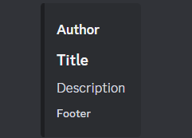

This cheat sheet provides a quick reference for the embeds feature in Discord.

## Embed Example

 

## Creating Embed

Most of our commands will have a seperate subcommand `/<command> embed set` that allows you to create a custom embed for that command. Most of the time, you will be able to set the title, description, color, and footer of the embed however some commands may have additional fields.

## New lines

You can start a new line in the embed by using `(^n)`. If you want to type, `(^n)` (for some reason) you can do that by typing `(\^n)`.