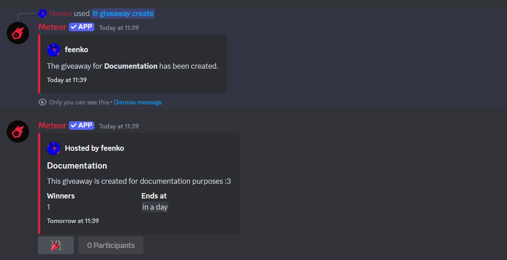

Learn more about our giveaways module.

## How does it work?

When you create a giveaway, Meteor will then send a message to the designated channel with the giveaway details. Users can then join giveaway by clicking button below the message.

After the giveaway ends, Meteor will automatically select a winner and mention them in the channel.

## Creating a giveaway

To create a giveaway, use the following command:

- `/giveaway create <prize> <winners> <time> [channel] [description]`

You can specify the channel using either the channel ID or by mentioning the channel. If you don't specify a channel, the giveaway will be created in the current channel.

The time parameter should be in the following format: `1d`, `1h`, `1m`, or `1s`. This will determine how long the giveaway will last.

After executing the command, you will see a confirmation message like this along with the giveaway message:

 

## Ending a giveaway

To end a giveaway, use the following command:

- `/giveaway end <message ID>`

After executing the command, Meteor will automatically select a winner and mention them in the channel.

## Re-rolling a giveaway

If you want to re-roll a giveaway, use the following command:

- `/giveaway reroll <message ID>`

This will select a new winner for the giveaway.

## Deleting a giveaway

To delete a giveaway, simply remove the giveaway message from the channel.

If the bot will not detect message with giveaway, it will automatically delete the giveaway.