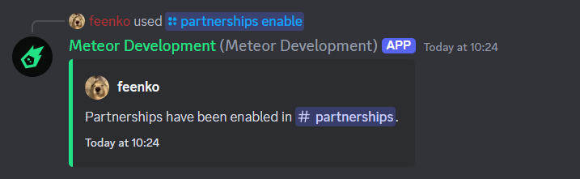

Learn more about our partnerships module.

## How does it work?

Once the Partnerships module is enabled, you can create partnerships by posting a message in the designated channel. The message should include an invite link.

The system will track the number of partnerships established through this method, allowing you to see how many partnerships have been successfully created.

## Enabling Partnerships

!!!
You can assign more than one channel to the Partnerships module. This is useful if you have multiple channels where users can post partnership messages.
!!!

To enable the Partnerships module, use the following command:

- `/partnerships enable <channel> [role]`

You can specify the channel using either the channel ID or by mentioning the channel.

Optionally, you can designate a specific role with the permission to create partnerships. Only users with this role will be counted towards the partnership count. If you don't specify a role, all users will be able to create partnerships.

After executing the command, you will see a confirmation message like this:

 

## Disabling Partnerships

Disabling the Partnerships module is just as easy as enabling it. Simply use the following command:

- `/partnerships disable <channel>`

## Further Customization

You can customize the Partnerships module by setting your own unique message. To do this, simply use the command:

- `/partnerships embed set`

Then, fill in the required information. This feature allows you to create a tailored message that will be displayed whenever a user partners with your server.

!!!
To view the current state of the message, use the command `/partnerships embed view`.
!!!

### Variables

You can use the following variables in your message:

+++ User
Variable | Description | Example
--- | --- | ---
`{user}` | The message author | `@feenko`
`{user.partnerships}` | The number of partnerships the message author has made | `5`
+++ Invite
Variable | Description | Example
--- | --- | ---
`{invite}` | The invite url of the partner server | `https://discord.gg/meteor`
`{invite.guild}` | The name of the partner server | `Meteors HQ`
`{invite.code}` | The invite code of the partner server | `meteor`
+++ Guild
Variable | Description | Example
--- | --- | ---
`{guild}` | The name of the current server | `Meteor HQ`
`{guild.members}` | The number of members in the current server | `1000`
`{guild.partnerships}` | The number of partnerships the current server has made | `10`